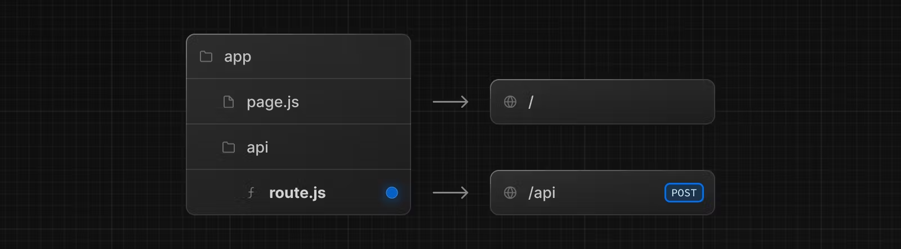

# CSGO's Dune Analytics
This is a [Next.js](https://nextjs.org/) project bootstrapped with ReactJS. Additionally, MongoDB and an EC2 instance are used.

Current: A simple malleable dashboard with an Items Search, Price Chart and Item Detail

<details>
<summary>Seeing data presented in an aesthetically pleasing manner on dashboards is satisfying.</summary>
<br>

Similar to why financial management dashboards like MercuryOS has risen successful, I believe dashboards molded with good design can become powerful operating systems in respective domains.

Despite this project being risen out of simple love for CSGO, I believe that the concept of a *malleable* dashboard is applicable to any scenario where a user has to navigate to multiple sites to complete some action. Or, to manually copy and paste data into some spread sheet to perform analysis. 

(Web3 especially, maybe a portfolio/broker/swap/lp/yieldfarm/additional modules would be a good idea...)

So many cool things can just be dashboards.
</details>

## Running the Application

```bash
npm run dev
# or
yarn dev
# or
pnpm dev
# or
bun dev
```

Open [http://localhost:3000](http://localhost:3000) with your browser.

## Demo

[Insert a screen recorded thing of the app here, screen.studio] or visit the actual link on github

## App Structure 

**Backend** 
1. **Mongo** Database containing a collection of items-data, and their {name, price_history} specifically
2. AWS **EC2** Instance running a NodeJS script periodically (10 days) to update Mongo Database (due to the api rate limit)

**Frontend**
1. NextJS, Tailwindcss, React Grid Layout: MongoDB processes price history queries from each query of dynamic api request from next server


```
└── csgo-mkt-may/
    ├── misc
    ├── scripts
    └── src/
        ├── app/
        │   ├── api
        │   ├── lib
        │   ├── GlobalContext.js
        │   ├── Suggestions.js
        │   ├── globals.css
        │   └── page.tsx
        └── components/
            ├── icons
            ├── sub-components
            └── InterfaceGrid.js
```
Notes:
* `misc` has files that help with auto suggestions of the search (instead of querying mongodb every single time)
* `scripts` contains the test script and actual script running in the EC2 instance to load and update the MongoDB database 
* `src/` is all frontend code (which will be explained below)


# Process in making this project

## The Backend : Creating the script and setting up MongoDB & AWS
Notes: Install Node.js

To have a meaningful dashboard, I needed data. So I used someone else's items data [SteamAPI](https://steamapis.com/) (don't roast me for this, need to learn how to make a scraper)

### Query Script (NOTE, Script is not currently active, MONGO too expensive)

I made a script to query the api, take the csgo item data, and shove it into MongoDB. (`data_scripts.js`)

In `data_scripts.js` I combined the functionality of updating and getting data together, meaning that this script works to initially get data, and then update data periodically on the EC2 instance. 

The driver function `async function fetchData()` loops through through  each item name stored locally in `items_list.json`:

* If item alreaddy exists -> checks if item prices are old* <br /> (yes) -> updates item prices via a new query to SteamAPI <br/>
(no) -> doesn't do anything
* If Item doesn't alreay exist -> Add the obj to MongoDB

MongoDB Notes:
* Initial DB Connection in NodeJS needs to be setup according to [this](https://www.mongodb.com/docs/drivers/node/current/quick-start/connect-to-mongodb/) (`async function setup()`)
* [insertOne({...})](https://www.mongodb.com/docs/drivers/node/current/usage-examples/insertOne/), [replaceOne({...})](https://www.mongodb.com/docs/drivers/node/v4.0/usage-examples/replaceOne/#:~:text=replaceOne()%20accepts%20a%20query,with%20the%20provided%20replacement%20document.), [findOne({...})](https://www.mongodb.com/docs/drivers/node/current/usage-examples/findOne/)

##### Personal Notable Learnings (script)

I learned the most about handling rate limits while creating this script. Here's a list of all possible [status codes](https://www.webfx.com/web-development/glossary/http-status-codes/)

Full disclaimer here, as I have only encountered a 429 error while running the script (assuming that I do have a correct API key), I wrote the script to handle such a scenario only: via delays.
* 429 is the api rate exceeded error

This was handled by the `function delay(ms)` that would initialize a new promise that contained a `setTimeout(() => resolve, ms)` to artificially delay the entire NodeJS program. This works because by design of `fetchData()` and other functions that interact with MongoDB being `async`, it's effectively a synchronous program that waits for execution of `delay(some ms)`. 
<br />
<br />

### Setting up AWS 

EC2 SSH
1. Log on to AWS and have a credit card (charged 1 dollar to make an account)
2. Create an Linux/Ubuntu EC2 instance through their interface 
    * In the key pair I chose to get a RSA .pem key
    * Also a security group that aallowed SSH traffic from the anywhere
3. In terminal, navigate to the .pem key directory (probably downloads) and type `chmod 400 <filename.pem>`
4. Open AWS EC2 instances list and click connect at the top, it should give an example link for use via SSH (I didn't use putty)
5. Paste that into the same terminal session on 4
6. You should see signs of success in terminal (Credits to this [tutorial](https://asf.alaska.edu/how-to/data-recipes/connect-to-ec2-with-ssh-mac-os-x/#:~:text=Connect%20to%20an%20EC2%20Instance,your%20Mac%20Terminal%20window%20later.))

Github Setup
1. In the SSH, follow this [tutorial](https://medium.com/@rajani103/deploying-nodejs-app-on-aws-ec2-instance-step-by-step-1b00f807cdce) from step 3 to step 4 to setup
2. In the root directory, if there's no /home, `mkdir` one 
3. Execute `ssh-keygen -t ed25519 -a 100 -C "<your GitHub account email>"`
4. Navigate to the `/.ssh` directory in the ec2 instance where the key pairs are stored 
5. `cat <your-key-name.pub>` to display the key
6. Add a deploy key in github settings and paste the output of the previous step into the key field
7. Test connection to github: ssh -T git@github.comd
8. After success, git clone the actual repository link.git
9. [Credit](https://medium.com/@qylong2021/clone-organization-owned-private-repository-on-aws-ec2-instances-fb712dbf03ad)

<br />
<br />

After the EC2 instance is setup with the git repo containing the script, one should run two autonomous processes through one command. Respectively [`nohup`](https://ioflood.com/blog/nohup-linux-command/#Getting_Started_with_Nohup) and [`crontab`](https://www.youtube.com/watch?v=7cbP7fzn0D8)

#### nohup

Nohup is used as a way to run tasks in terminal without an active terminal session. So a task can be started in a terminal session and be disconnected to run "by itself".

In this program, I used nohup to start running the Node.js script so that it starts disconnected from the terminal itself (and I can close the ssh terminal and it would keep running): `nohup node ./scripts/data_scripts.js & disown`

Mainly, `&` lets the program run in the background of the current terminal session (so that its not taking up space in your terminal), then `disown` detaches the background process from the current terminal session (or the shell's job table to be precise). So `&` would not make the process entirely independent, since it would still die as you kill the terminal session. 

#### crontab

Now that I am able to run a single independent process on an EC2 without having my SSH session connected after starting the task, I can now schedule the `nohup` process to trigger autonomously using `cron`.

Cron is a super useful service in linux based systems that allow commands to be run periodically. Crontab commands generally come in this format

`m h d m w <command>`

The first m is the specific minute, h is the hour, d is day, second m is the month, and w is the specific weekday to run `<command>`

So here I can run the nohup command above using cron to independently run the script on an EC2 instance.

`0 0 */10 * * nohup node /home/csgo-mkt-may/scripts/data_script.js > output.txt & disown`

(`> output.txt` directs the output of the nohup command to a specific file)


## Setting up Frontend

Here is just general React and Nextjs components, so I'll mainly share the stuff I learned (Moving from ReactJS to NextJS).
* SSR vs CSR, App router and structuring API queries in NextJS
* Singleton pattern connections to database (may not have been the best)
* Promise + setTimeout pattern

### SSR and APIs

Basically a way for Next to optimize rendering. Components which are static can be rendered on the server and sent to the client as pure HTML to minimize strain on client.

This means the SSR components don't have abilities for interaction when rendered on client side, so it's really just good for static components which don't change (E.g. Landing pages). Pure HTML (CSS) being transmitted means that JS functionality, like hooks and functions that are run onClick, are not permitted. So if you are doing some hover effect, better do it through HTML.

There weren't any substantial non-interactive components in this app. I just had to put "use client" on components which are client side rendered. `page.tsx` is server side rendered, that has client side children components. 

----
#### Making Requests in NextJS

SSR is also a good way to abstract away making heavy requests directly from the client side, so you don't have to deal with useEffect BS. 

    Big Context: There are mainly [4 ways](https://nextjs.org/docs/app/building-your-application/data-fetching/fetching-caching-and-revalidating) to fetch data in NextJS
1. On the server, with fetch
2. On the server, with third-party libraries
3. On the client, via a Route Handler
4. On the client, with third-party libraries.


**Fetching "on the server"** means that a server side rendered component needs fetched data initially when rendering/building.
* (Static Generation option, SSG, will be specified on a `route.ts` file)
NextJS will fetch the data on build and then combine that data with the server side HTML and send it to the client (only 1 request on build request).

* (SSR, Dynamic Generation)
On every render (site load), NextJS will send HTML with fresh data (request every render)

**Fetching "on the client"**, client side component has interaction that triggers requests
* Makes requests to the server, to tell it to make some request to the external service, every time the client component needs the data

^ That way, the client does not bear too heavy of a network load and just needs to communicate with the server itself

Now, I think NextJS explains Route Handlers the best.

"Route Handlers allow you to create custom request handlers for a given route using the Web Request and Response APIs."

 [Source](https://nextjs.org/docs/app/building-your-application/routing/route-handlers)

```ts
/* app/api/route.ts
*/

export async function GET() {
  const res = await fetch('https://data.mongodb-api.com/...', {
    headers: {
      'Content-Type': 'application/json',
      'API-Key': process.env.DATA_API_KEY,
    },
  })
  const data = await res.json()
 
  return Response.json({ data })
}
```

Essentially, in the context above, when you make a GET request to `<domain>/api`, it's handled by the route.ts file's GET function.

Like how routing works in NextJS, you can make other API routes by creating other `route.ts` files in different (nested) folders inside of the `/api` directory.

What I did here is define a route.ts and a `async function GET(request: NextRequest)` inside of the `/api/route.ts` to query MongoDB.

For example, I can do this in my app:
```ts
fetch("/api/").then(res => res.json())
.then(res => console.log(res))
```

#### Query Parameters

Now simple GET requests which do the same thing aren't interesting.

To specify what item I wanted to get data for from MongoDB, I used NextRequest's [search params](https://nextjs.org/docs/app/building-your-application/routing/route-handlers) object.

```ts
// Line 6
export async function GET(request: NextRequest) {

    ...

    // Line 21
    const searchParams = request.nextUrl.searchParams;
    
}
```

The NextRequest object makes it pretty easy to access details about the request. However, there's definitely more ways to pass data through requests as outlined through their documentation of making requests to route handlers.


---
### Singleton pattern

This is essentially making sure that you don't make multiple connections to a database (E.g. MongoDB). 

The Singleton pattern is the use of a JS class that has a static variable and static function. 

This is useful because MongoDB's connection scheme creates a client instance that provides the initial connection, and uses that `MongoClient` instance to access the db and collection itself, to actually query data.

So in `dbconnection.ts`, I've created a `static instance` so `static async getInstance()` will only make the `new MongoClient` instantiation connection only once in the application's lifetime. 

(Talk more about static methods and the actual framework of the singleton pattern)

Note: We need the `static` variable and `static` method in the class so it's not possible to have multiple instances with duplicate MongoClient variables (Nature of static keyword).

More on [Singletons](https://javascriptpatterns.vercel.app/patterns/design-patterns/singleton-pattern).

In essence, allowing the client to experience less load when using the application and cost savings in MongoDB. 

---

### Making an "Artificial" Promise

(Likely) One of the huge inefficiencies with the project is its large quantities of queries to the MongoDB database that leads to high serverless costs. This is especially the case when price needs to be updated. 

So, one of the optimizations that I've made in development was making search suggestions local as CSGO items are rather unchanging in medium timeframes (A list of 22418 items).

Initially I did this:
```ts
// const searchText = ...
// const itemsData = ...
const itemSuggestions = itemsData.filter((itemName) => {
  if (itemName.toLowerCase().includes(searchText)) {
    return itemName;
  } 
})
```

But this f***ed up the app. Heavy non-async tasks like string searching through an item list of over twenty thousand was relatively slow (a few seconds, but slow enough to lag the app).

Fundamentally, JavaScript is a single threaded event loop, and thus one can imagine it dealing with tasks one by one linearly (A worker and a callstack). 

React, being built on top of JS, is still bound by the callstack nature of JS. State updates and user interaction of React are also "tasks" of the callstack.

So if the current task of searching through suggestions is clogging the callstack, any user interaction with the site will be unresponsive until the task is done. 

Well, if JS is linear, wouldn't even slower tasks like using a promise to fetch from an API freeze an app even more?

Well promises + setTimeout utility is cool. They allow us to "queue" an asynchronous operation in the **background**.

So, to improve UX and save $, I made the search suggestions operation and the item properties search operation local. 

To do this, I can create a fake `Promise` and process the heavy task with the app bring conscious of the callstack

To implement this, setTimeout needed to be understand more:
* `setTimeout(...somefunc..., timeToWait)` is a function that waits `timeToWait` milliseconds before executing `somefunc`
* But, the overlooked part of setTimeout is that it doesn't actually execute `somefunc` exactly after `timeToWait` ms, `timeToWait` ms is the minimum waited time before execution. 
* This is because setTimeout's other condition is waiting before all other operations on the callstack have completed to then bring "focus" to this background task. This property has allowed processing patterns such as chunk processing, to separate the heavy code in the promise into different setTimeouts to have less interference with the callstack thus reducing lag.


#### Important Distinction here:
* `Promise` allows you to wait until some process is resolved.
* `setTimeout` allows you to manage the heavier processing inside the promise such that reduces lag on the application

For instance, fetching from an API wouldn't require you to use setTimeout because there is no truely heavy processing done by the callstack. Just a *boop* initially to contact the API and then the promise just sits in the background until that API *boop*s back to resolve the promise.

But for my search suggestions case:
```js
// Suggestions.js - Line 5
// For suggestions
export function getSuggestions(query) {
    return new Promise((resolve, reject) => {
        setTimeout(() => {
            const result = search(query);
            resolve(result);
        })
    })
}

// Search through the data for a match of the search
function search(query) {
    const itemNames = Object.keys(data);
    return itemNames.filter((thing) => {
        return thing.toLowerCase().includes(query.toLowerCase());
    });
}
```
The promise will not be resolved until the `const result = search(query)` is processed, so there is processing for our application callstack. And thus, I needed to put this in a setTimeout chunk to minimize clogging of the callstack considering other interactions (with 0ms as I don't need any delay in my setTimeout).

Since my "heavy search task" actually only takes ~1-2 seconds, it suffices to be placed in one setTimeout. But, for **heavier** processes, it would be best to break a big `setTimeouts` into smaller `setTimeouts` inside of the `Promise`, which would run linearly and allow them to be inserted into the callstack in a more elegant fashion.

## Other ReactJS Libraries used
* [react-grid-layout](https://github.com/react-grid-layout/react-grid-layout)
* [lightweight-charts](https://www.tradingview.com/lightweight-charts/)

## Learn More about NextJS

To learn more about Next.js, take a look at the following resources:

- [Next.js Documentation](https://nextjs.org/docs) - learn about Next.js features and API.
- [Learn Next.js](https://nextjs.org/learn) - an interactive Next.js tutorial.

You can check out [the Next.js GitHub repository](https://github.com/vercel/next.js/) - your feedback and contributions are welcome!

## Deploy on Vercel

The easiest way to deploy your Next.js app is to use the [Vercel Platform](https://vercel.com/new?utm_medium=default-template&filter=next.js&utm_source=create-next-app&utm_campaign=create-next-app-readme) from the creators of Next.js.

Check out our [Next.js deployment documentation](https://nextjs.org/docs/deployment) for more details.
